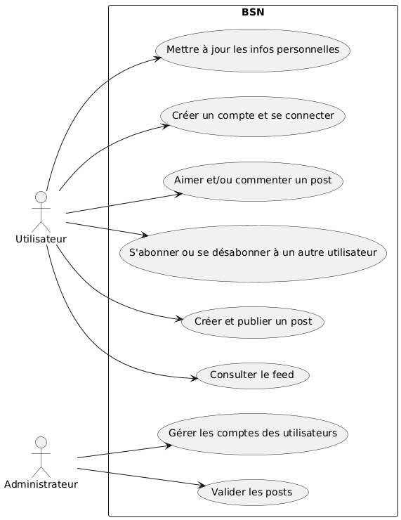
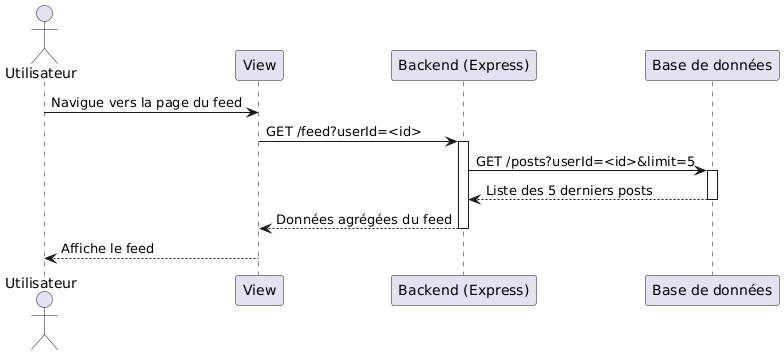
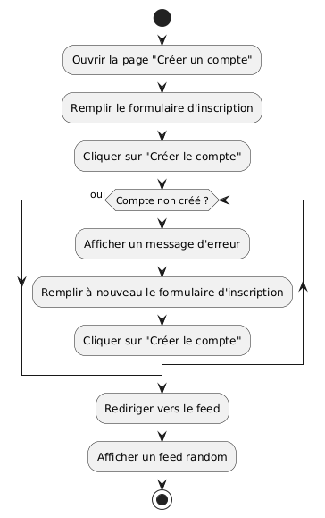
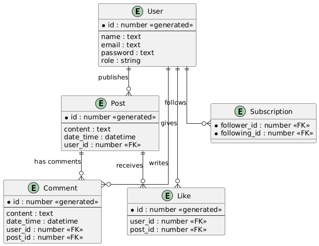
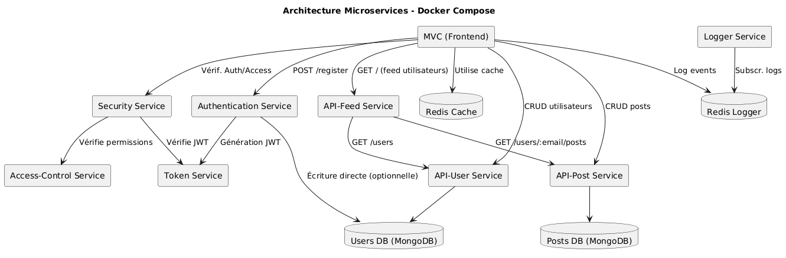

<!--
**MarionGirard33/MarionGirard33** is a ✨ _special_ ✨ repository because its `README.md` (this file) appears on your GitHub profile.

Here are some ideas to get you started:

- 🔭 I’m currently working on ...
- 🌱 I’m currently learning ...
- 👯 I’m looking to collaborate on ...
- 🤔 I’m looking for help with ...
- 💬 Ask me about ...
- 📫 How to reach me: ...
- 😄 Pronouns: ...
- ⚡ Fun fact: ...
-->

## Hi there 👋 I'm Marion !

Passionate about development, I decided to change careers after several years working as a Product Owner in an Agile Scrum team.

[LinkedIn](https://www.linkedin.com/in/mariongirard33/) | [Mail](marion.girard33@gmail.com)

---

🌟 I first took a distance-learning course in 2022-2023, validated by a Level 5 RNCP title in Web Integration Developer:

- Creation of a website from a Figma or Photoshop model
- Creation of CSS animations to liven up a web page
- Page optimization, performance, SEO, accessibility
- Creation of a secure API with Node.JS, Express and MongoDB
- Drafting of technical documentation
- Perform unit, end-to-end and integration tests

🌱 I'm now deepening this knowledge by taking part in a work-study program to become an Application Developer Designer until June 2026.

---

## ⚡ Technologies

### Web

### UX/UI

### Management methodologies and tools

---

## 📊 Design & UML Diagrams

To better understand the design of my projects, here are some UML diagrams used:

- **Use Case Diagram**

    
  _This diagram illustrates the interactions between actors and the system._

- **Sequence Diagram**

    
  _This diagram describes the exchange of messages between components over time._

- **Activity Diagram**

    
  _This diagram shows the workflows and business processes._

- **ERD (Entity-Relationship Diagram)**

    
  _This diagram models the entities and their relationships in the database._

- **Architecture Diagram**  
    
  _Overview of the system's architecture._
